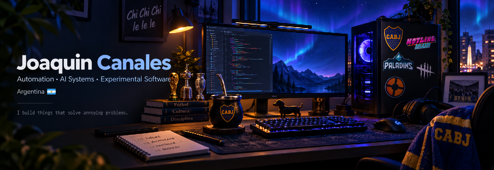

<p align="center">
  
</p>

<h1 align="center">Hi, I'm Joaquin Canales</h1>

<p align="center">
  <b>Python Developer · Automation · AI Experiments · Software Engineering</b>
</p>

<p align="center">
  Building things that automate boring work, experiment with AI,
  solve oddly specific problems, and occasionally count dachshunds.
</p>

---

## About Me

I'm a developer from Argentina focused mainly on **Python, automation and software engineering**.

I enjoy taking repetitive or unusual problems and turning them into actual working systems — whether that means automating large workflows, building an autonomous companion for a videogame, or creating an unnecessarily sophisticated mobile app to count dachshunds.

Most of my projects usually start with:

> "Could this be automated?"

or, occasionally:

> "This would be funny to build."

And then things get out of hand.

---

## Featured Projects

### Project Borealis

**Enterprise Course Automation System**

A Python-based automation ecosystem designed to transform large repetitive course-processing workflows into a structured, traceable and recoverable pipeline.

**Highlights**

- Browser automation with Selenium and Playwright
- SQL-backed state tracking
- Automated validation
- Batch processing
- Duplicate prevention
- Structured logging and failure recovery
- Approximately **98.8% reduction in processing time**
- Large workflows reduced from roughly **one working week to ~20 minutes**

[View Project Borealis](https://github.com/Joaquin-Galle-ui/Project-Borealis)

---

### Bot Co-op — The Binding of Isaac

**Autonomous Second Player Experiment**

An experimental autonomous co-op companion for *The Binding of Isaac*.

Instead of requiring another player, the project creates a computer-controlled Player 2 capable of navigating rooms, targeting enemies, fighting, avoiding hazards and following the main player.

An optional Python layer adds voice interaction, LLM integration and virtual controller support.

**Built with**

`Lua` · `Python` · `Game AI` · `Voice Commands` · `LLM Integration` · `Virtual Controller`

[View Bot Co-op](https://github.com/Joaquin-Galle-ui/BotCoop-TheBindingofIsaac)

---

### Contador de Perros Salchichas

**Because apparently counting dachshunds needed cloud infrastructure.**

What started as a tiny personal counter for my girlfriend and me eventually became a mobile dachshund sighting tracker.

It now includes:

- Cloud synchronization
- Firebase integration
- Individual sighting records
- Coat classifications and rarity levels
- Achievements and milestones
- Push notifications
- Android integration
- Hidden features and easter eggs
- An extremely serious commitment to dachshund statistics

**Built with**

`Godot 4` · `GDScript` · `Firebase` · `Google Apps Script` · `Android`

[View Contador de Perros Salchichas](https://github.com/Joaquin-Galle-ui/Contador-de-Perros-Salchichas)

---

## Tech Stack

<p align="center">


<br>


</p>

---

## What I Like Building

```text
Automation          ███████████████████░
Python              ███████████████████░
AI Experiments      ████████████████░░░░
Game Development    █████████████░░░░░░░
Web Development     ████████████░░░░░░░░
Dachshund Systems   ████████████████████
```

I am particularly interested in projects involving:

- Process automation
- AI-assisted systems
- Browser automation
- System integrations
- Game AI and experimental tools
- Backend logic
- Mobile applications
- Turning questionable ideas into functioning software

---

## Development Philosophy

I like projects where software has a visible purpose.

Sometimes that means reducing a workflow from days to minutes.

Sometimes it means experimenting with autonomous game behavior.

Sometimes it means making sure two people never forget how many dachshunds they have seen.

Different scale.

Same idea:

**Find a problem. Build something useful. Learn from the process.**

---

<p align="center">
  <b>Made in Argentina.</b>
</p>

<p align="center">
  Automation · Software · Games · Experiments
</p>